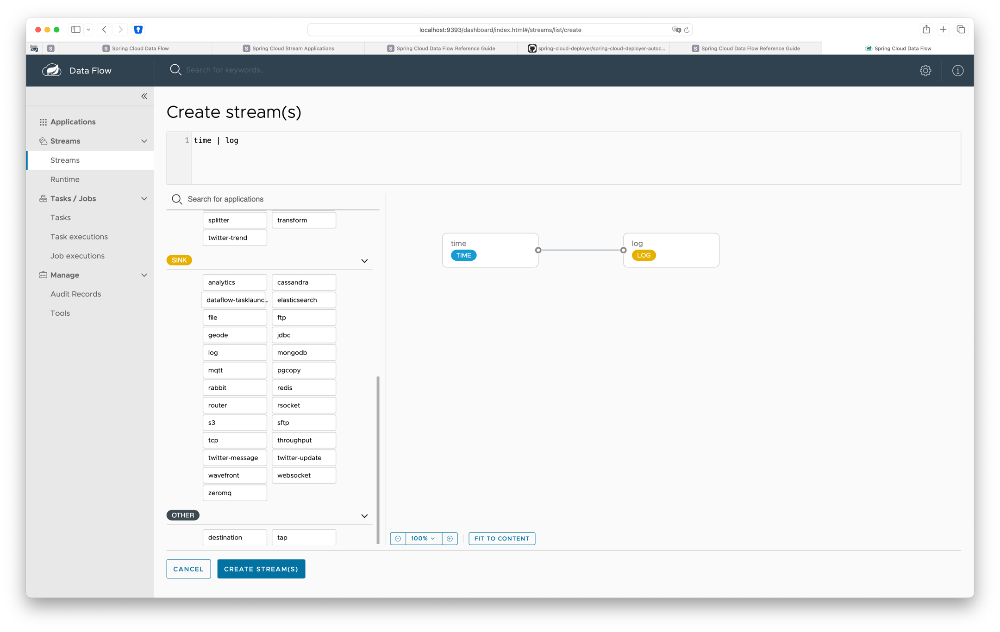

== Features

* The Spring Cloud Data Flow server uses https://github.com/spring-cloud/spring-cloud-deployer/[Spring Cloud Deployer], to deploy data pipelines made of Spring Cloud Stream or Spring Cloud Task applications onto modern platforms such as Cloud Foundry and Kubernetes.
+
[CAUTION]
====
This deployer SPI has been implemented for several runtime environments:

* https://github.com/spring-cloud/spring-cloud-deployer/tree/main/spring-cloud-deployer-local[Local] - Spring Cloud Local Deployer is an implementation of the Spring Cloud Deployer SPI for use to deploy applications on the same machine. This occurs by this application spawning a new JVM process for the deployed application;
+
It’s important to note that (from deployer https://github.com/spring-cloud/spring-cloud-deployer/tree/main/spring-cloud-deployer-local[readme]):

** this deployer _spawns new JVMs_ that are not monitored or maintained by this deployer;
** no attempts at high availability, fault tolerance, or resiliency are provided by the deployer;
** since the deployer SPI expects an underlying platform to provide that level of resiliency, *any use of this deployer in a production environment should be accompanied with additional monitoring at the app level* (the apps this deployer deploys). This deployer will not be updated to take on those requirements. Therefore the user is encouraged to explore the CloudFoundry and Kubernetes variants as ways to meet them;
* https://github.com/spring-cloud/spring-cloud-deployer/tree/main/spring-cloud-deployer-kubernetes[Kubernetes] - A Spring Cloud Deployer implementation for deploying long-lived streaming applications and short-lived tasks to Kubernetes. It uses `KubernetesAutoConfiguration` and `io.fabric8.kubernetes.api` to create K8S containers dynamically;
* Cloud Foundry
====

* A selection of pre-built https://spring.io/projects/spring-cloud-stream-applications/[stream] (Spring Cloud Stream Applications are standalone executable applications that communicate over messaging middleware) and https://docs.spring.io/spring-cloud-dataflow/docs/current/reference/htmlsingle/#_out_of_the_box_task_applications[task/batch] (Spring Cloud Task allows a user to develop and run short lived microservices using Spring Cloud ) starter apps for various data integration and processing scenarios facilitate learning and experimentation.
+
NOTE: Spring Cloud Stream Applications are dependency for Spring Data Flow, so you could run it independently from SDF. To run them through SDF they must be registered in SDF repository first, so they could be deployed by Skipper. The list of pre-build applications is https://github.com/spring-cloud/stream-applications#reusable-spring-cloud-stream-applications[available on Github].

* While Data Flow includes source, processor, sink applications, you can extend these applications or write a custom https://github.com/spring-cloud/spring-cloud-stream[Spring Cloud Stream] application. You can follow the https://dataflow.spring.io/docs/stream-developer-guides/streams/standalone-stream-sample[Stream Development guide] on the Microsite to create your own custom application. Once you have created a custom application, you can register it, as described in https://docs.spring.io/spring-cloud-dataflow/docs/current/reference/htmlsingle/#spring-cloud-dataflow-register-stream-apps[Register a Stream Application].

* A simple stream pipeline DSL makes it easy to specify which apps to deploy and how to connect outputs and inputs. The composed task DSL is useful for when a series of task apps require to be run as a directed graph.
+
[NOTE]
====
As a simple example, consider the collection of data from an HTTP Source and writing to a File Sink. Using the DSL, the stream description is:
[source,text]
http | file

A stream that involves some processing would be expressed as:

[source,text]
http | filter | transform | file
====

* The dashboard offers a graphical editor for building data pipelines interactively, as well as views of deployable apps and monitoring them with metrics using Wavefront, Prometheus, Influx DB, or other monitoring systems.
+

* The Spring Cloud Data Flow server exposes a REST API for composing and deploying data pipelines. A separate shell makes it easy to work with the API from the command line.
+
[NOTE]
====
To run shell from the demo, just do ``make dataflow-shell``. That should give you a prompt:

.Example Data Flow CLI command
[source,shell]
----
make dataflow-shell
while ! curl http://localhost:9393/dashboard </dev/null; do sleep 3; done
java -jar spring-cloud-dataflow-shell.jar
dataflow:>help
AVAILABLE COMMANDS

App Registry Commands
       app default: Change the default application version
       app info: Get information about an application
       app unregister: Unregister an application
       app import: Register all applications listed in a properties file
       app all unregister: Unregister all applications
       app register: Register a new application
       app list: List all registered applications

Built-In Commands
       help: Display help about available commands
       stacktrace: Display the full stacktrace of the last error.
       clear: Clear the shell screen.
       quit, exit: Exit the shell.
       history: Display or save the history of previously run commands
       version: Show version info
       script: Read and execute commands from a file.

Config Commands
       dataflow config info: Show the Dataflow server being used
       dataflow config server: Configure the Spring Cloud Data Flow REST server to use

Http Commands
       http post: POST data to http endpoint
       http get: Make GET request to http endpoint

Job Commands
       job execution step display: Display the details of a specific step execution
       job execution step list: List step executions filtered by jobExecutionId
       job instance display: Display the job executions for a specific job instance.
       job execution restart: Restart a failed job by jobExecutionId
       job execution list: List created job executions filtered by jobName
       job execution display: Display the details of a specific job execution
       job execution step progress: Display the details of a specific step progress

Runtime Commands
       runtime actuator post: Invoke actuator POST endpoint on app instance
       runtime apps: List runtime apps
       runtime actuator get: Invoke actuator GET endpoint on app instance

Stream Commands
       stream scale app instances: Scale app instances in a stream
       stream platform-list: List Skipper platforms
       stream all undeploy: Un-deploy all previously deployed stream
       stream history: Get history for the stream deployed using Skipper
       stream update: Update a previously created stream using Skipper
       stream info: Show information about a specific stream
       stream manifest: Get manifest for the stream deployed using Skipper
       stream deploy: Deploy a previously created stream using Skipper
       stream all destroy: Destroy all existing streams
       stream validate: Verify that apps contained in the stream are valid.
       stream list: List created streams
       stream undeploy: Un-deploy a previously deployed stream
       stream rollback: Rollback a stream using Skipper
       stream create: Create a new stream definition
       stream destroy: Destroy an existing stream

Task Commands
       task validate: Validate apps contained in task definitions
       task platform-list: List platform accounts for tasks
       task destroy: Destroy an existing task
       task create: Create a new task definition
       task execution log: Retrieve task execution log
       task execution list: List created task executions filtered by taskName
       task all destroy: Destroy all existing tasks
       task execution cleanup: Clean up any platform specific resources linked to a task execution
       task execution status: Display the details of a specific task execution
       task list: List created tasks
       task execution stop: Stop executing tasks
       task execution current: Display count of currently executin tasks and related information
       task launch: Launch a previously created task

Task Scheduler Commands
       task schedule destroy: Delete task schedule
       task schedule create: Create new task schedule
       task schedule list: List task schedules by task definition name
----
====
