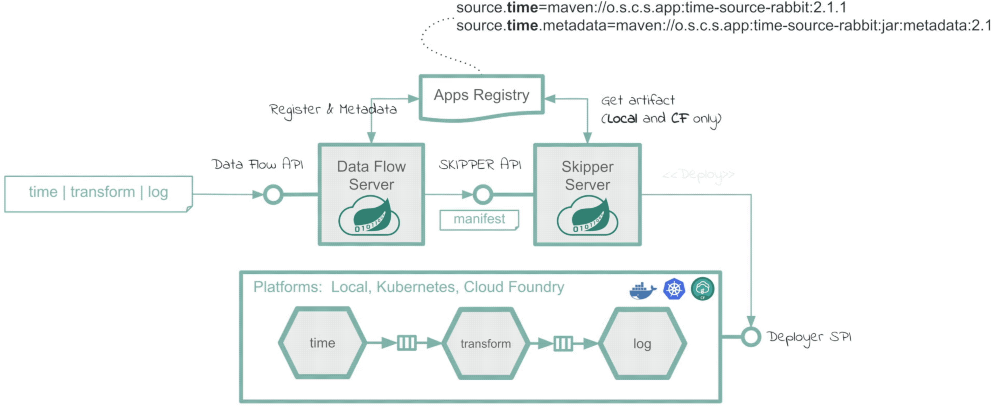

= Spring Data Flow demo
Based on official Spring Boot / Cloud documentation: https://spring.io/projects
:toc: left

Microservice based Streaming and Batch data processing for Cloud Foundry and Kubernetes.

Spring Cloud Data Flow provides tools to create complex topologies for streaming and batch data pipelines. The data pipelines consist of Spring Boot apps, built using the Spring Cloud Stream or Spring Cloud Task microservice frameworks.

Spring Cloud Data Flow supports a range of data processing use cases, from ETL to import/export, event streaming, and predictive analytics.

include::features.adoc[leveloffset=0]

== Components for streaming

.Server components according to https://dataflow.spring.io/docs/stream-developer-guides/getting-started/stream/

NOTE: The Data Flow Server and Skipper Server need to have an RDBMS installed. By default, the servers use an embedded H2 database. You can configure the servers to use external databases. The supported databases are H2, HSQLDB, MariaDB, Oracle, Postgresql, DB2, and SqlServer. The schemas are automatically created when each server starts.

include::server-dataflow.adoc[leveloffset=+1]
include::server-skipper.adoc[leveloffset=+1]

kafka-broker & zookeeper
postgres

== Spring Data Flow Application Development

https://dataflow.spring.io/docs/stream-developer-guides/

=== Components

Standard starter applications https://github.com/spring-cloud/stream-applications/blob/main/README.adoc[GIT repository] consists of pre-build source, processor and sink applications, which are build upon https://github.com/spring-cloud/spring-functions-catalog[Spring Cloud Function applications].

[WARNING]
====
Applications follow a naming convention: <functionality>-<type>-<binder>. For example, `rabbit-sink-kafka` is a Rabbit sink that uses the Kafka binder that is running with Kafka as the middleware.

Available Spring Cloud Stream application types:

* `source` that connects to an external resource to poll and receive data that is published to the default “output” channel;
* `processor` that receives data from an “input” channel and processes it, sending the result on the default “output” channel;
* `sink` that connects to an external resource to send the received data to the default “input” channel.

Available out-of-the-box binders:

* `kafka`
* `rabbit`

====

==== demohttp-publisher-kafka

==== storage-sink-kafka

