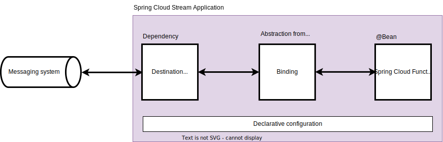

= Spring Data Flow demo
Based on official Spring Boot / Cloud documentation: https://spring.io/projects
:toc: left

Microservice based Streaming and Batch data processing for Cloud Foundry and Kubernetes.

Spring Cloud Data Flow provides tools to create complex topologies for streaming and batch data pipelines.
The data pipelines consist of Spring Boot apps, built using the Spring Cloud Stream or Spring Cloud Task microservice frameworks.

Spring Cloud Data Flow supports a range of data processing use cases, from ETL to import/export, event streaming, and predictive analytics.

include::features.adoc[leveloffset=0]

== Components for streaming

.Server components according to https://dataflow.spring.io/docs/stream-developer-guides/getting-started/stream/
image::architecture-sdf.png[align=center]

NOTE: The Data Flow Server and Skipper Server need to have an RDBMS installed.
By default, the servers use an embedded H2 database.
You can configure the servers to use external databases.
The supported databases are H2, HSQLDB, MariaDB, Oracle, Postgresql, DB2, and SqlServer.
The schemas are automatically created when each server starts.

include::server-dataflow.adoc[leveloffset=+1]
include::server-skipper.adoc[leveloffset=+1]

kafka-broker & zookeeper postgres

== Spring Cloud Stream application

https://dataflow.spring.io/docs/stream-developer-guides/

Standard starter applications https://github.com/spring-cloud/stream-applications/blob/main/README.adoc[GIT repository] consists of pre-build source, processor and sink applications, which are build upon https://github.com/spring-cloud/spring-functions-catalog[Spring Cloud Function applications].

=== Application naming

Applications follow a naming convention: <functionality>-<type>-<binder>.
For example, `rabbit-sink-kafka` is a Rabbit sink that uses the Kafka binder that is running with Kafka as the middleware.

Available Spring Cloud Stream application types:

* `source` that connects to an external resource to poll and receive data that is published to the default “output” channel;
* `processor` that receives data from an “input” channel and processes it, sending the result on the default “output” channel;
* `sink` that connects to an external resource to send the received data to the default “input” channel.

Available out-of-the-box binders:

* `kafka`
* `rabbit`

=== Application model

====
Official documentation: https://docs.spring.io/spring-cloud-stream/reference/spring-cloud-stream.html
====

.Application abstractions components

Messaging system:: any messaging system that is supported by destination binder (standard is Kafka or RabbitMQ);

Declarative configuration:: a standardized Spring application configuration that express: destination binder properties (e.g. Kafka broker and messaging configuration) and binding between user code (beans) and destination binder (using specialized conventions);

Destination binder:: a "driver" that delivers and retrieves messages to the messaging system;
+
.Example POM dependencies
[source,xml]
----
<dependencies>
    <dependency>
        <groupId>org.springframework.cloud</groupId>
        <artifactId>spring-cloud-stream</artifactId> <!--1-->
    </dependency>
    <dependency>
        <groupId>org.springframework.cloud</groupId> <!--2-->
        <artifactId>spring-cloud-stream-binder-kafka</artifactId>
    </dependency>
    <dependency>
        <groupId>org.springframework.kafka</groupId> <!--2-->
        <artifactId>spring-kafka</artifactId>
    </dependency>
</dependencies>
----

<1> Spring Cloud Stream abstractions
<2> destination binder

Binding:: an Spring Cloud Stream abstraction that represents a bridge between sources (inputs) and targets (outputs) exposed by the destination binder and user code;
+
.Example app configuration
[source,yaml,line-comment=#]
----
spring:
  cloud:
    stream:
      bindings:
        demoData-out-0:                 # <1>
          destination: "demo-data-raw"
      kafka:
        binder:
          brokers:                      # <2>
            - "broker:9092"
----

<1> binds Kafka topic "demo-data-raw" with a function "demoData" output
<2> Kafka broker configuration

Spring Cloud Function:: a programming model for the user code that represents business logic that operates on input and output messages;
+
[source,java]
----
@Bean
public Supplier<String> demoData() {        // <1>
    return () -> "Demo message; ts: %d".formatted(Instant.now().toEpochMilli());
}
----

<1> a function that is used for binding as "demoData-out-0"

=== Native consumer groups support

Each consumer binding can use the `spring.cloud.stream.bindings.<bindingName>.group` property to specify a group name.

All groups that subscribe to a given destination receive a copy of published data, but only one member of each group receives a given message from that destination.
By default, when a group is not specified, Spring Cloud Stream assigns the application to an *anonymous and independent single-member consumer group* that is in a publish-subscribe relationship with all other consumer groups.

NOTE: More info: https://docs.spring.io/spring-cloud-stream/reference/spring-cloud-stream/consumer-groups.html

=== Native partitioning support

Spring Cloud Stream provides support for partitioning data between multiple instances of a given application.
Spring Cloud Stream provides a common abstraction for implementing partitioned processing use cases in a uniform fashion.
Partitioning can thus be used whether the broker itself is naturally partitioned (for example, Kafka) or not (for example, RabbitMQ).

Partitioning is a critical concept in stateful processing, where it is critical (for either performance or consistency reasons) to ensure that all related data is processed together.
For example, in the time-windowed average calculation example, it is important that all measurements from any given sensor are processed by the same application instance.

WARNING: To set up a partitioned processing scenario, you must configure both the data-producing and the data-consuming ends.

.Configuration options for partitioning
[cols="1a,1a"]
|===
|Producer side (output bindings) |Consumer side (input bindings)

|You can configure an output binding to send partitioned data by setting one and only one of its `partitionKeyExpression` or `partitionKeyExtractorName` properties, as well as its `partitionCount` property.

For example, the following is a valid and typical configuration:

[source,properties]
----
spring.cloud.stream.bindings.func-out-0.producer.partitionKeyExpression=headers.id

spring.cloud.stream.bindings.func-out-0.producer.partitionCount=5
----

|An input binding (with the binding name uppercase-in-0) is configured to receive partitioned data by setting its `partitioned` property, as well as the `instanceIndex` and `instanceCount` properties on the application itself, as shown in the following example:

[source,properties]
----
spring.cloud.stream.bindings.uppercase-in-0.consumer.partitioned=true

spring.cloud.stream.instanceIndex=3

spring.cloud.stream.instanceCount=5
----
|===

NOTE: More info in official documentation: https://docs.spring.io/spring-cloud-stream/reference/spring-cloud-stream/overview-partitioning.html

=== Functional bindings

The naming convention used to name input and output bindings is as follows:

----
input - <functionName> + -in- + <index>
output - <functionName> + -out- + <index>
----

The in and out correspond to the type of binding (such as input or output).
The index is the index of the input or output binding.
It is always 0 for a typical single input/output function, so it’s only relevant for functions with multiple input and output arguments.

.Example of simple functional binding
[source,yaml,line-comment=#]
----
spring:
  cloud:
    stream:
      bindings:
        demoData-out-0:                  # <1>
          destination: "demo-data-raw"
----

<1> binds Kafka topic "demo-data-raw" with a function "demoData" output

You can also map an implicit binding name (e.g. `demoData-out-0`) to an explicit binding name (e.g. `raw`) using

----
spring.cloud.stream.function.bindings.<binding-name> property.
----

.Example of functional binding with explicit binding name
[source,yaml,line-comment=#]
----
spring:
  cloud:
    stream:
      function:
        bindings:
          demoData-out-0: raw           # <1>
      bindings:
        raw:                            # <2>
          destination: demo-data-raw
----

<1> implicit binding name to an explicit binding name
<2> explicit binding name destination configuration

NOTE: A recommendation from Spring is to avoid using it ;)

=== Producing and consuming messages

====
Official documentation of Spring Cloud Function: https://cloud.spring.io/spring-cloud-function/reference/html/spring-cloud-function.html#_programming_model
====

Spring Cloud Function embraces and builds on top of the 3 core functional interfaces defined by Java and available to us since Java 8.

* java.util.function.Supplier<O>
* java.util.function.Function<I, O>
* java.util.function.Consumer<I>

==== Supplier (source)

.Supplier example
[source,java]
----
@Bean
public Supplier<Date> date() {
    return () -> new Date(12345L);
}
----

Supplier is in its own category when it comes to triggering.
Since it is, by definition, the source (the origin) of the data, it does not subscribe to any in-bound destination and, therefore, has to be triggered by some other mechanism(s).

The framework provides a default _polling mechanism_ that will trigger the invocation of the supplier (i.e. its `get()` function) and by default it will do so every second.

The polling mechanism could be configured

NOTE: Supplier could be *imperative* or *reactive* and which directly relates to the triggering.
Reactive suppliers are triggered once, whereas imperative ones use a polling mechanism.
See https://docs.spring.io/spring-cloud-stream/reference/spring-cloud-stream/producing-and-consuming-messages.html#polling-configuration-properties[documentation for the polling mechanism].

There are two ways to define a message key:

* using `producer.partition-key-expression` or
* (in case of Kafka) directly add a key to an outbound record.

.Example of using `producer.partition-key-expression`
[source,yaml]
----
spring:
  cloud:
    stream:
      bindings:
        demoData-out-0:
          destination: demo-data-raw
          producer:
            partition-key-expression: headers['partitionKey'] # <1>
            partition-count: 3
----

<1> Partition expression that instructs Spring Cloud Stream to use a Message header `partitionKey` to calculate a Kafka partition (Kafka key will not be set)

.Example of adding a Kafka key to outbound record
[source,java]
----
@Bean
public Supplier<Message<String>> demoData() {
    return () -> {
        var ts = Instant.now().toEpochMilli();
        var key = ((Long) (ts % 3)).toString().getBytes();
        var payload = "Demo message; ts: %d".formatted(ts);
        LOG.info("Message produced {}", payload);

        return MessageBuilder
                .withPayload(payload)
                .setHeader(KafkaHeaders.KEY, key) // <1>
                .build();
    };
}
----

<1> Adding a key directly to the message that will appear as a Kafka message key and not be visible in message headers

==== Function (processor)

.Function example
[source,java]
----
@Bean
public Function<String, String> toUpperCase() {
    return s -> s.toUpperCase();
}
----

You can compose one or more functions to pipelines, so messages flow through all in given order, but code stays separated.
Consider the below configuration example that uses two functions beans: `toUpperCase` and `addStaticString`.

[source,yaml]
----
spring:
  cloud:
    function:
      definition: toUpperCase|addStaticString                   # <1>
    stream:
      function:
        bindings:
          toUpperCase|addStaticString-in-0: processed-data-in   # <2>
          toUpperCase|addStaticString-out-0: processed-data-out # <2>
      bindings:
        processed-data-in:                                      # <3>
          destination: demo-data-raw
        processed-data-out:                                     # <3>
          destination: demo-data-processed
----

<1> function pipeline definition using Spring bean names
<2> re-naming (binding) long function names to easy to use names (optional configuration)
<3> using re-named function for Spring Cloud Stream binding

==== Consumer (sink)

.Consumer example
[source,java]
----
@Bean
public Consumer<String> sink() {
    return System.out::println;
}
----

Topics: message routing

=== Error handling

=== Testing
