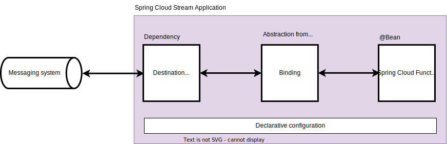

== Application model

====
Official documentation: https://docs.spring.io/spring-cloud-stream/reference/spring-cloud-stream.html
====

.Application abstractions components

Messaging system:: any messaging system that is supported by destination binder (standard is Kafka or RabbitMQ);

Declarative configuration:: a standardized Spring application configuration that express: destination binder properties (e.g. Kafka broker and messaging configuration) and binding between user code (beans) and destination binder (using specialized conventions);

Destination binder:: a "driver" that delivers and retrieves messages to the messaging system;
+
.Example POM dependencies
[source,xml]
----
<dependencies>
    <dependency>
        <groupId>org.springframework.cloud</groupId>
        <artifactId>spring-cloud-stream</artifactId> <!--1-->
    </dependency>
    <dependency>
        <groupId>org.springframework.cloud</groupId> <!--2-->
        <artifactId>spring-cloud-stream-binder-kafka</artifactId>
    </dependency>
    <dependency>
        <groupId>org.springframework.kafka</groupId> <!--2-->
        <artifactId>spring-kafka</artifactId>
    </dependency>
</dependencies>
----

<1> Spring Cloud Stream abstractions
<2> destination binder

Binding:: an Spring Cloud Stream abstraction that represents a bridge between sources (inputs) and targets (outputs) exposed by the destination binder and user code;
+
.Example app configuration
[source,yaml,line-comment=#]
----
spring:
  cloud:
    stream:
      bindings:
        demoData-out-0:                 # <1>
          destination: "demo-data-raw"
      kafka:
        binder:
          brokers:                      # <2>
            - "broker:9092"
----

<1> binds Kafka topic "demo-data-raw" with a function "demoData" output
<2> Kafka broker configuration

Spring Cloud Function:: a programming model for the user code that represents business logic that operates on input and output messages;
+
[source,java]
----
@Bean
public Supplier<String> demoData() {        // <1>
    return () -> "Demo message; ts: %d".formatted(Instant.now().toEpochMilli());
}
----

<1> a function that is used for binding as "demoData-out-0"

=== Native consumer groups support

Each consumer binding can use the `spring.cloud.stream.bindings.<bindingName>.group` property to specify a group name.

All groups that subscribe to a given destination receive a copy of published data, but only one member of each group receives a given message from that destination.
By default, when a group is not specified, Spring Cloud Stream assigns the application to an *anonymous and independent single-member consumer group* that is in a publish-subscribe relationship with all other consumer groups.

NOTE: More info: https://docs.spring.io/spring-cloud-stream/reference/spring-cloud-stream/consumer-groups.html

=== Native partitioning support

Spring Cloud Stream provides support for partitioning data between multiple instances of a given application.
Spring Cloud Stream provides a common abstraction for implementing partitioned processing use cases in a uniform fashion.
Partitioning can thus be used whether the broker itself is naturally partitioned (for example, Kafka) or not (for example, RabbitMQ).

Partitioning is a critical concept in stateful processing, where it is critical (for either performance or consistency reasons) to ensure that all related data is processed together.
For example, in the time-windowed average calculation example, it is important that all measurements from any given sensor are processed by the same application instance.

WARNING: To set up a partitioned processing scenario, you must configure both the data-producing and the data-consuming ends.

.Configuration options for partitioning
[cols="1a,1a"]
|===
|Producer side (output bindings) |Consumer side (input bindings)

|You can configure an output binding to send partitioned data by setting one and only one of its `partitionKeyExpression` or `partitionKeyExtractorName` properties, as well as its `partitionCount` property.

For example, the following is a valid and typical configuration:

[source,properties]
----
spring.cloud.stream.bindings.func-out-0.producer.partitionKeyExpression=headers.id

spring.cloud.stream.bindings.func-out-0.producer.partitionCount=5
----

|An input binding (with the binding name uppercase-in-0) is configured to receive partitioned data by setting its `partitioned` property, as well as the `instanceIndex` and `instanceCount` properties on the application itself, as shown in the following example:

[source,properties]
----
spring.cloud.stream.bindings.uppercase-in-0.consumer.partitioned=true

spring.cloud.stream.instanceIndex=3

spring.cloud.stream.instanceCount=5
----
|===

NOTE: More info in official documentation: https://docs.spring.io/spring-cloud-stream/reference/spring-cloud-stream/overview-partitioning.html

=== Functional bindings

The naming convention used to name input and output bindings is as follows:

----
input - <functionName> + -in- + <index>
output - <functionName> + -out- + <index>
----

The in and out correspond to the type of binding (such as input or output).
The index is the index of the input or output binding.
It is always 0 for a typical single input/output function, so it’s only relevant for functions with multiple input and output arguments.

.Example of simple functional binding
[source,yaml,line-comment=#]
----
spring:
  cloud:
    stream:
      bindings:
        demoData-out-0:                  # <1>
          destination: "demo-data-raw"
----

<1> binds Kafka topic "demo-data-raw" with a function "demoData" output

You can also map an implicit binding name (e.g. `demoData-out-0`) to an explicit binding name (e.g. `raw`) using

----
spring.cloud.stream.function.bindings.<binding-name> property.
----

.Example of functional binding with explicit binding name
[source,yaml,line-comment=#]
----
spring:
  cloud:
    stream:
      function:
        bindings:
          demoData-out-0: raw           # <1>
      bindings:
        raw:                            # <2>
          destination: demo-data-raw
----

<1> implicit binding name to an explicit binding name
<2> explicit binding name destination configuration

NOTE: A recommendation from Spring is to avoid using it ;)
